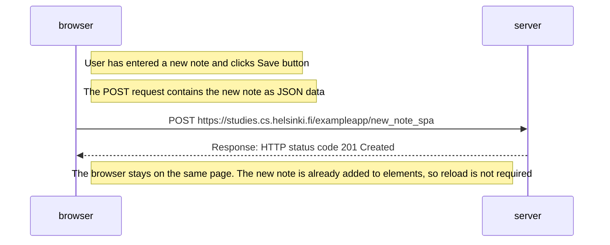

```mermaid
sequenceDiagram
    participant browser
    participant server

    Note right of browser: User has entered a new note and clicks Save button
    Note right of browser: The POST request contains the new note as JSON data
    browser->>server: POST https://studies.cs.helsinki.fi/exampleapp/new_note_spa
    server-->>browser: Response: HTTP status code 201 Created

    Note right of browser: The browser stays on the same page. The new note is already added to elements, so reload is not required
``` 